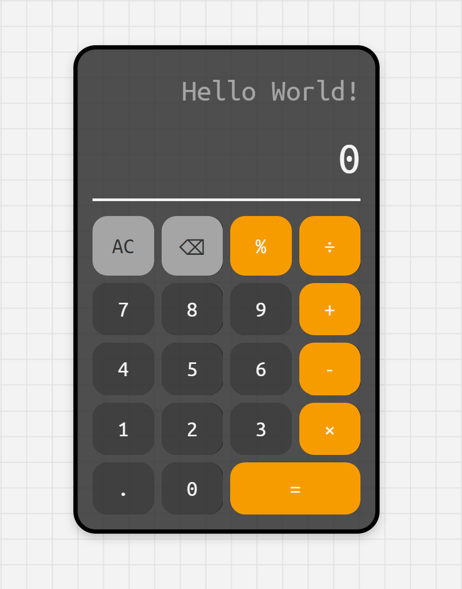

# Calculator-Odin

A browser-based Calculator created as part of [The Odin Project's](https://www.theodinproject.com) Foundations curriculum.

## Features

- **All Basic Operations:** Addition, subtraction, multiplication, and division.
- **Chained Operations:** Perform sequential calculations like `12 + 7 - 5` without needing to press equals in between.
- **Decimal Support:** Input floating-point numbers with the `.` key.
- **Percentage Operator:** Quickly calculate percentages.
- **Keyboard Support:** Use your physical keyboard for all calculator inputs.
- **Backspace:** Correct mistakes with a backspace button (`⌫`).
- **Clear Functions:** `AC` (All Clear) to completely reset the calculator.

## Keyboard Shortcuts

| Key(s)         | Action          |
| -------------- | --------------- |
| `0-9`          | Number input    |
| `+`, `-`, `/`, `%` | Operators       |
| `*`            | Multiplication  |
| `.`            | Decimal point   |
| `Enter` or `=`   | Evaluate        |
| `Backspace`    | Delete last digit |
| `Escape`       | All Clear (AC)  |

## Technologies Used

*   HTML5
*   CSS3
*   Vanilla JavaScript

## Acknowledgments

*   This project is a solution to the [Project Calculator](https://www.theodinproject.com/lessons/foundations-calculator#project-solution) from The Odin Project.
*   Background pattern from [uiverse.io](https://uiverse.io/kennyotsu-monochromia/spotty-cheetah-65).